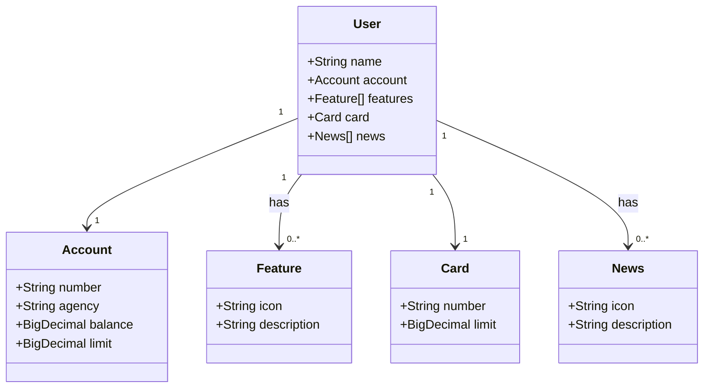

# Bank API - API RESTful

Bank API é uma API RESTful desenvolvida em **Java 17** com **Spring Boot 3**, projetada para fornecer serviços bancários de maneira eficiente e segura.

## Tecnologias Principais

As tecnologias utilizadas garantem escalabilidade, segurança e facilidade de desenvolvimento:

- **Java 17**: Utilização da versão LTS mais recente do Java, proporcionando estabilidade e suporte a longo prazo.
- **Spring Boot 3**: Framework moderno que simplifica a criação de aplicações Java com configuração automática e produtividade aprimorada.
- **Spring Data JPA**: Facilita o acesso e a manipulação de dados em bancos SQL, reduzindo o boilerplate.
- **OpenAPI (Swagger)**: Fornece documentação interativa e intuitiva da API, facilitando sua exploração e uso.

## Instalação e Execução

Siga os passos abaixo para configurar e executar o projeto localmente:

1. **Clone o repositório:**
   ```sh
   git clone https://github.com/seu-usuario/bank-api.git
   cd bank-api
   ```

2. **Configure o banco de dados:**
    - O projeto utiliza **MariaDB**. Certifique-se de que o banco esteja instalado e rodando.
    - Configure as credenciais no arquivo `application.properties`:
      ```properties
      spring.datasource.url=jdbc:mariadb://localhost:3306/bank_db
      spring.datasource.username=seu_usuario
      spring.datasource.password=sua_senha
      ```

3. **Execute a aplicação:**
   ```sh
   ./mvnw spring-boot:run
   ```
   A aplicação estará acessível em `http://localhost:8080`.

4. **Acesse a documentação da API:**
   ```
   http://localhost:8080/swagger-ui.html
   ```

## Estrutura da API

A API segue um padrão RESTful bem definido, permitindo operações como:

- **Usuários**: Criação, leitura, atualização e remoção de contas de usuários.
- **Contas bancárias**: Gerenciamento de saldo, limites e transações.
- **Cartões**: Consulta de cartões vinculados a uma conta.
- **Notícias e funcionalidades**: Listagem de novidades e serviços bancários disponíveis.

## Diagrama de Classes

O seguinte diagrama ilustra a estrutura principal da API:



## Licença

Este projeto está licenciado sob a MIT License. Veja o arquivo [LICENSE](LICENSE) para mais detalhes.

