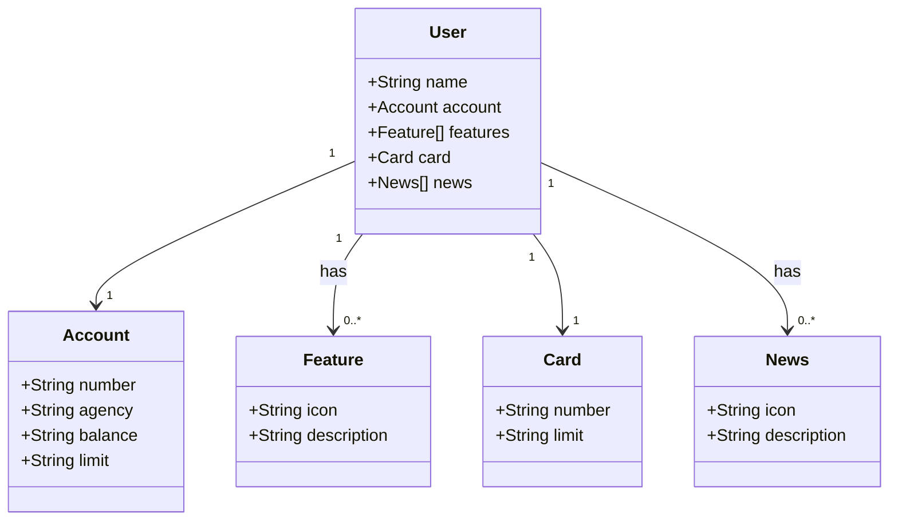

# Diagrama de Classes

```mermaid
classDiagram
    class User {
        +String name
        +Account account
        +Feature[] features
        +Card card
        +News[] news
    }

    class Account {
        +String number
        +String agency
        +String balance
        +String limit
    }

    class Feature {
        +String icon
        +String description
    }

    class Card {
        +String number
        +String limit
    }

    class News {
        +String icon
        +String description
    }

    User "1" --> "1" Account
    User "1" --> "0..*" Feature : has
    User "1" --> "1" Card
    User "1" --> "0..*" News : has
```